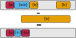
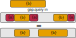

## This crate has been absorbed into the `nodit` crate

Please switch to using the `Gqdit` type in the `nodit` crate as this crate will
no longer be receiving updates.

## Old README

A crate that provides a gap-query optimized interval-tree
data-structure.

`no_std` is supported and should work with the default features.

There are three main operations available on this data-structure:
insertion, removal and gap-queries. Each of which are `O(log(N) + K)`
where `N` is the total number of intervals in the tree and `K` is the
number of intervals required to be processed.

Here are visualizations of the three operations:

# Insertion

# Removal

# Gap-Query

